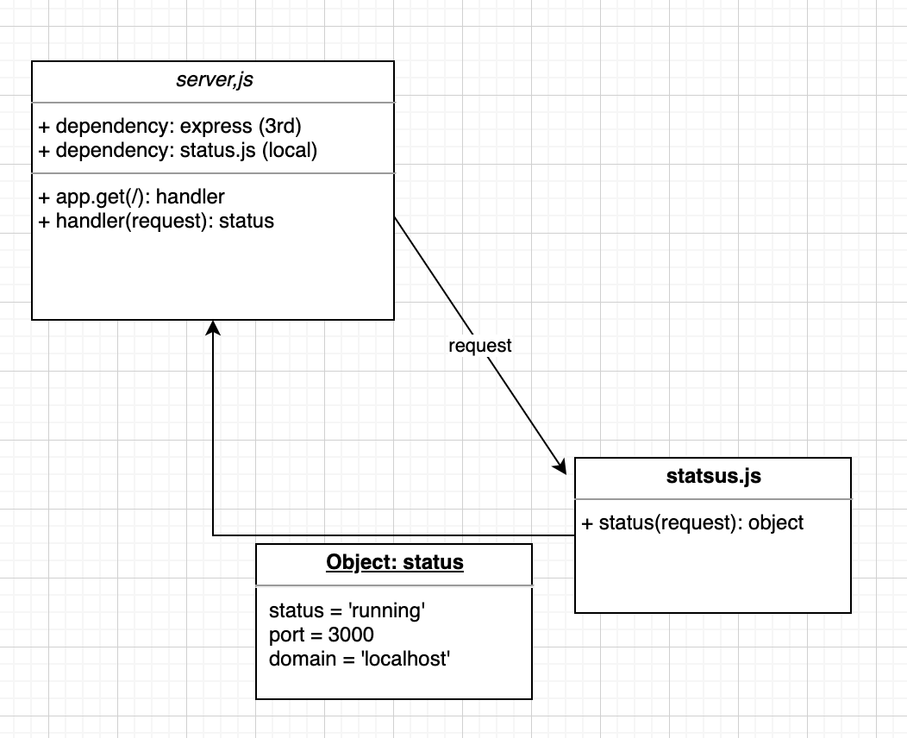

# notes

# LAB - 01

## Deployment Test

### Author: Kevin McNeil (copied from John Cokos)

- [tests report](https://github.com/codefellows/code-401-javascript-example-lab/actions)
- [front-end](https://code-401-js-lab-example.herokuapp.com/status)

### Resources and helps

 - mob programmed with Sara R, Michael E, and Spencer L.
 - [link to Console messages with jest](https://stephencharlesweiss.com/jest-testing-spyon-consoles/)
 - [help from Mongoosejs.com](https://mongoosejs.com/docs/api.html#model_Model.deleteOne)

### Setup

#### `.env` requirements

- `PORT` - Port Number

#### Running the app

- `npm start`
- Endpoint: `/status`
  - Returns Object

    ```javascript
    {
      "domain": "john-api-server.demo.herokuapp.com",
      "status": "running",
      "port": 42123
    }
    ```

#### Tests

- Unit Tests: `npm run test`
- Lint Tests: `npm run lint`

#### UML

(Created with [diagrams](https://app.diagrams.net/))

